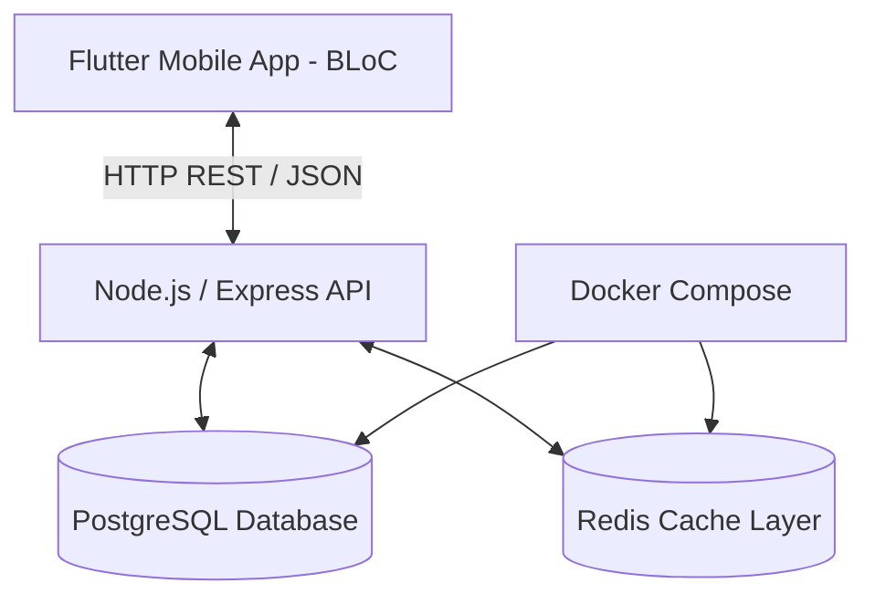

# EcoEcho

[](https://flutter.dev)
[](https://nodejs.org)
[](https://www.postgresql.org)
[](https://redis.io)
[](https://www.docker.com)

"Micro-habits for a macro-impact." 

Inspired by Strava, EcoEcho is a social environmental platform designed to document sustainable practices, track green missions, and foster community engagement through gamified tier progressions and localized leaderboards.

---

## Features

- **Dynamic Social Feed:** Share and log eco-friendly activities. Sort feed dynamically by Latest or Popular (using a weighted algorithm: Likes + Comments - Downvotes).
- **Interactive Leaderboard:** Track and rank user contributions in real-time.
- **Mission Prerequisites Tree:** Unlock environmental milestones sequentially using dependency resolution.
- **EcoWrap Analytics:** Annual carbon footprint/impact review with precise percentile calculations.
- **Find-a-Buddy:** Look up other users to form green action groups.

---

## Architecture and Tech Stack



- **Frontend:** Flutter and Dart (State Management: BLoC pattern for predictable state flow)
- **Backend:** Node.js / Express (Modular router architecture)
- **Database:** PostgreSQL (Relational schema for users, posts, and mission graphs)
- **Caching:** Redis (Performance optimizations for leaderboard retrieval)
- **Infrastructure:** Docker Desktop and Docker Compose (Containerized services)

---

### DAA Algorithm Implementations

EcoEcho leverages fundamental computer science algorithms to power core features:

| Feature | Algorithm | Purpose / Complexity |
| :--- | :--- | :--- |
| **Leaderboard Rankings** | Max-Heap Sort | Sorts users dynamically based on total green XP points in $O(N \log N)$ time. |
| **Mission Hierarchies** | Depth-First Search (DFS) | Validates that the mission prerequisite graph is a Directed Acyclic Graph (DAG) and ensures users unlock missions in correct topological order. |
| **Popularity Sort** | Counting Sort | Sorts posts on the social feed based on weighted engagement score in $O(N + K)$ linear time. |
| **EcoWrap Analytics** | Binary Search | Locates user XP thresholds to map users into percentile brackets. |
| **Find-a-Buddy Lookup** | String Matching | Performs prefix/pattern searches on user UIDs/handles. |

---

### Repository Structure

```plaintext
EcoEcho/
├── backend/
│   ├── database/           # PostgreSQL Schema (init.sql)
│   ├── db/                 # DB Seeding configuration (seed.sql)
│   ├── src/
│   │   ├── algorithms/     # DAA Algorithms (Heap Sort, DFS, Counting Sort, etc.)
│   │   ├── config/         # Database and environment configurations
│   │   ├── controllers/    # API Controllers
│   │   └── routes/         # Express API endpoints
│   ├── index.js            # Main backend server runner
│   └── migrate.js          # DB Migrations setup
└── frontend/
    ├── assets/             # Images, fonts, and local configurations
    ├── lib/
    │   ├── features/       # Core app modules (Feed, Missions, Profile, Auth)
    │   └── main.dart       # App entry point
    └── pubspec.yaml        # Flutter dependencies
```
## Getting Started

### Prerequisites
- **Git**
- **Docker Desktop**
- **Node.js** (v18+)
- **Flutter SDK** (Stable)

### Local Setup Instructions

1. **Clone the repository:**
   ```bash
   git clone [https://github.com/EcoEcho-DAA/EcoEcho.git](https://github.com/EcoEcho-DAA/EcoEcho.git)
   cd EcoEcho
  ```
2. Start PostgreSQL and Redis (Docker):
  ``bash
  docker-compose up -d
  ```
3. Initialize the Database Schema:
  Windows (PowerShell):
  ```PowerShell
  Get-Content backend\database\init.sql -Raw | docker exec -i ecoecho-postgres psql -U eco_admin -d ecoecho_db
  ```
  Mac / Linux (Bash):
  ```bash
  docker exec -i ecoecho-postgres psql -U eco_admin -d ecoecho_db < backend/database/init.sql
4. Initialize Backend Environment and Seed:
  - Create a .env file inside backend/ mirroring your environment settings. Then run:
```bash
cd backend
npm install
node run_seed.js
npm start
```
Verify the server is running on http://localhost:3000.

5. Launch Flutter Frontend:
```bash
cd ../frontend
flutter pub get
flutter run
```
## Contribution Guidelines

To ensure a clean history and quality validation:

- **Branching:** Work must take place in branch names following `feature/description`, `algo/description`, or `bugfix/description`. Direct pushes to `main` are restricted.
- **Commits:** Write clear semantic messages (e.g., `feat(backend): implement counting sort algorithm`).
- **Pull Requests:** Open a PR targeting `main`. Describe algorithm changes, including time/space complexities, and secure at least 1 team peer review approval.

For issues, support, or questions, contact roxanek.esquejo@gmail.com or contactjkeaviles@gmail.com.
